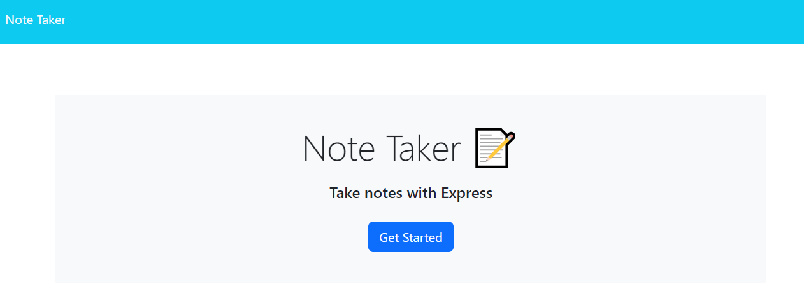

# Note Taker 

## License

This application uses the MIT license.

## Description

This application allows a user to write to-do notes for themselves. Notes can be added and deleted within the application.

## Table of Contents

* [Installation](#installation)
* [Usage](#usage)
* [License](#license)

## Installation Instructions

Clone the application's repository to your local machine. From your machine's terminal in the folder containing the generator's package.json file, run 'npm i' to install the required packages.

## Usage

Once a server instance has been started via the "node server" command in your terminal, navigate to http://localhost:6505. From the home page, click the blue Get Started button. From here you are able to enter a title and text for your note in the Note Title and Note Text sections by clicking or tabbing into them. Once both fields contain content a button in the shape of a disk appears in the upper right of the page - this button will allow you to save your note.

Saved notes can be accessed by clicking on their title on the left hand side of the page. From here they are able to be edited and saved once again. Alternatively, notes can be deleted by clicking on the red trash can icon.

When finished, be sure to press ctrl or command+C in your terminal to close the open server instance.

The page can also be accessed via Heroku [here](https://arcane-depths-93155.herokuapp.com/).

## Tests

None for this application.

## Questions

None for now.

## App Author

chocochip287 - [GitHub](https://github.com/chocochip287)

## Author's Email

chocochip287@gmail.com